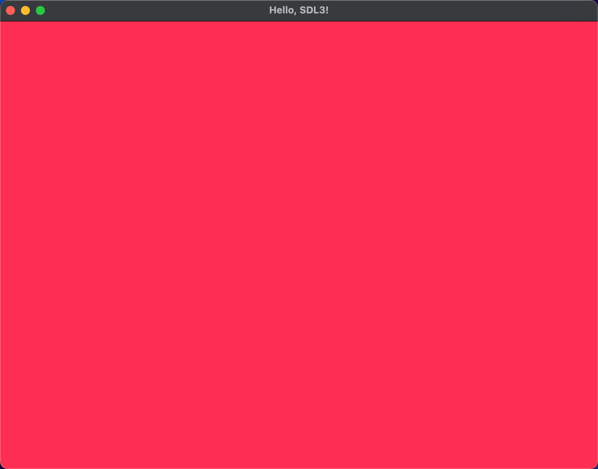
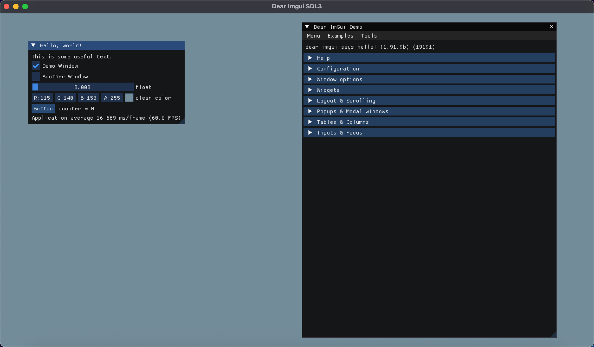
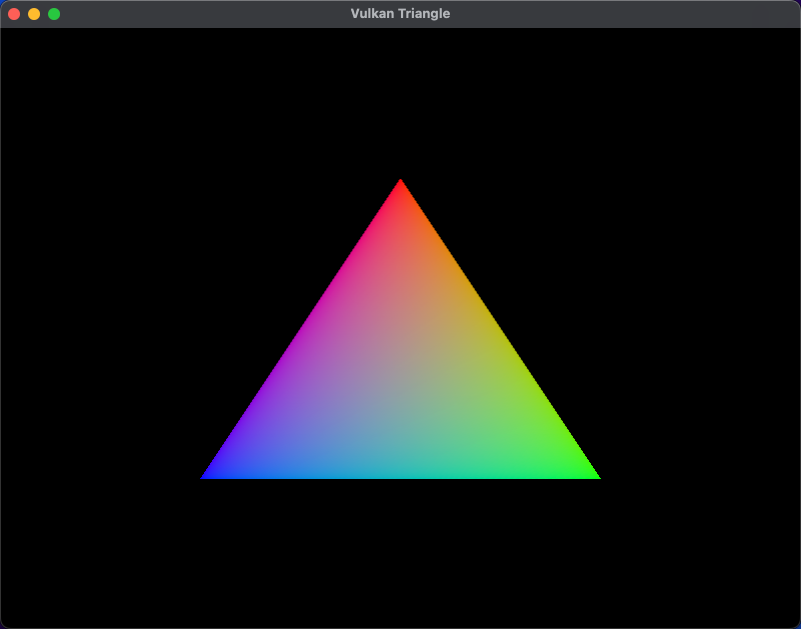
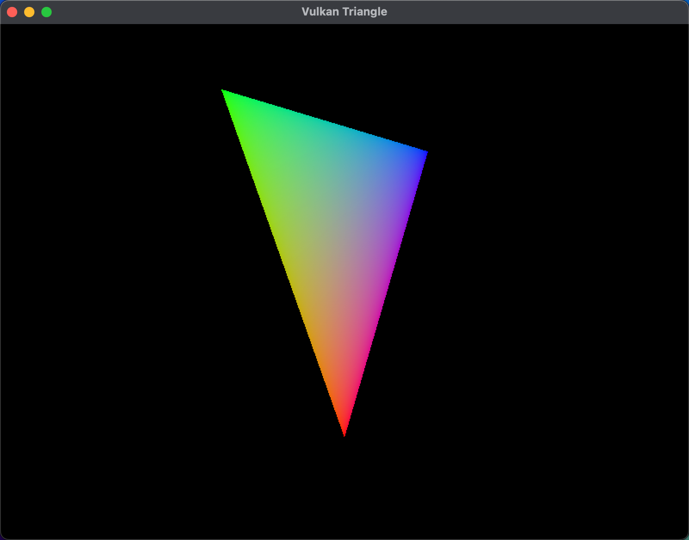

# MiniRender

<!--
 * @author: Avidel
 * @LastEditors: Avidel
-->

  
  
  

## Introduction
This is some examples for learning SDL3 and Vulkan.

MiniRender will start when my examples finish.

## 01_colorful_renderer

## 02_imgui_sdl3gpu

## 03_triangle

## 04_triangle_spin

